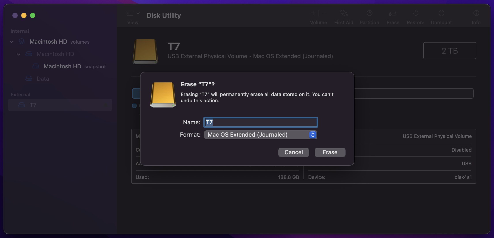

# Mac OS

If you are using an external drive make sure to format your external drive as `Mac OS Extended (Journaled)` before syncing the blockchain. Formatting as `ExFAT` will likely cause errors.

To format your drive open `Disk Utility` and select your external drive. Click `Erase` and select `Mac OS Extended (Journaled)`.

## Download Bitcoin Core

Head over to the [Bitcoin Core download page](https://bitcoin.org/en/download) and download the latest version of Bitcoin Core for Mac OS. Make sure to choose the `arm64` version if you have a new m-series Mac.

Install Bitcoin Core by dragging the application to your `Applications` folder.

Right click on the Bitcoin Core icon and select `Open`. You will be prompted with a warning that the application is from an unidentified developer. Click `Open`.

A welcome screen will appear and you will be asked to choose a location for the blockchain data. If you are using an external drive select your external drive. If you are using your internal drive you can choose the default location.
